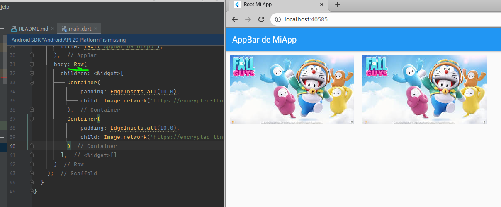

# Flutter

https://codepen.io/suyeta2002/pen/ExOBMee

# Table of Contents
1. [Introducción](#Introduccion)
    1. [Widget class](#WidgetClass)
        1. [StatefulWidget y State](#StatefulWidgetState)
            1. [Consideraciones de desempeño](#Desempeño)
            2. [Ejemplos](#Ejemplos)
4. [Fourth Example](#fourth-examplehttpwwwfourthexamplecom)

# Introducción <a id="Introducción"></a>

Los Widgets de Flutter se coonstruyen usando un framework moderno inspirado por React. Así como en React, los Widgets en Flutter es análogo a los componentes en React.

Los Widgets describen el aspecto que debería tener su vista con respecto a su configuración y estado actuales. Cuando el estado de un widget cambia, el widget reconstruye su descripción, la cual el framework compara con la descripción anterior para determinar los cambios mínimos requeridos en el árbol de renderizado subyacente para hacer la transición desde un estado al siguiente.

Flutter es un SDK, es decir, un kit de herramientas de UI. Fue desarrollada por google para realizar apliicaciones que pueden ser compiladas nativamente para móvil, web y escritorio desde una única base de código.

## Widget class <a id="WidgetClass"></a>

https://api.flutter.dev/flutter/widgets/Widget-class.html

Describe la configuración para un elemento. Un Widget describe cómo configurar un subtree, pero el mismo widget puede ser usado para configurar múltiples subtrees de forma simultáena ya que los widgets son <span style='color: #7CB9E8; font-weight: bold;'>inmutables</span>.

Los Widgets son la jerarquía de clases central del framework Flutter. Un widget es una descripción inmutable de parte de una interfaz de usuario. Los widgets pueden convertirse en elementos, que gestionan el árbol de renderizado subyacente.

Los widget por sí mismos no tienen un estado mutable (todos su campos deben ser final). Se puede asociar un estado mutable a un widget al usar **StatefulWidget**, el cual crea un objeto State (por medio de **StatefulWidget.createState**) cada que se convierte (inflated) en un elemento y se incorpora en el árbol.

Un widget dado puede ser incluido en el árbol cero o más veces. En particular, un widget puede ser colocado en el árbol múltiples veces. Cada que un widget se coloca en el árbol (it is inflated into an element) se convierte en un elemento, lo que significa que un widget que es incorporado múltiples veces en el árbol se inflará múltiples veces.

La propiedad **key** controla cómo un widget reemplaza otro widget en el árbol. Si las propiedades **runtimeType** y **key** de los dos widgets son **operator==** respectivamente, entonces el nuevo widget reemplaza al viejo al actualizar al elemento subyacente (es decir, al llamar **Element.update** con el nuevo widget). En caso contrario, el elemento viejo se elimina del árbol, el nuevo widget se infla en un elemento, y el elemento nuevo se inserta en el árbol.

### StatefulWidget y State <a id="StatefulWidgetState"></a>

https://api.flutter.dev/flutter/widgets/StatefulWidget-class.html

Un Widget que tiene estado mutable.

El State es información que:

1. Puede ser leída síncronamente cuando un widget es construido (built).
2. Puede cambiar durante el tiempo de vida de un widget.

El widget implementer se encarga de que State sea notificado cuando haya cambios al usar **State.setState**.

Un widget con estado es un widget que describe parte de la interfaz de usuario construyendo una constelación de otros widgets que describen la interfaz de usuario de forma más concreta. El proceso de construcción continúa recursivamente hasta que la descripción de la interfaz de usuario es totalmente concreta (por ejemplo, consiste enteramente en **RenderObjectWidgets**, que describen **RenderObjects** concretos).

Los widgets con estado son útiles cuando la parte de la interfaz de usuario que estás describiendo puede cambiar dinámicamente, por ejemplo, debido a que tiene un estado interno controlado por reloj, o dependiendo de algún estado del sistema. Para composiciones que dependen únicamente de la información de configuración del propio objeto y del BuildContext en el que se infla el widget, considere el uso de **StatelessWidget**.

Las propias instancias de **StatefulWidget** son inmutables y almacenan su estado mutable en objetos State independientes que se crean mediante el método **createState**, o en objetos a los que se suscribe ese State, por ejemplo, objetos **Stream** o **ChangeNotifier**, cuyas referencias se almacenan en campos finales del propio StatefulWidget.

El framework llama a **createState** cada vez que infla un **StatefulWidget**, lo que significa que múltiples objetos State pueden estar asociados con el mismo **StatefulWidget** si ese widget ha sido insertado en el árbol en múltiples lugares. Del mismo modo, si un **StatefulWidget** se retira del árbol y más tarde se inserta de nuevo en él, el framework volverá a llamar a **createState** para crear un nuevo objeto State, simplificando el ciclo de vida de los objetos State.

Un **StatefulWidget** mantiene el mismo objeto State cuando se mueve de un lugar a otro del árbol si su creador utilizó una **GlobalKey** para su clave. Dado que un widget con una **GlobalKey** puede utilizarse como máximo en una ubicación del árbol, un widget que utiliza una GlobalKey tiene como máximo un elemento asociado. El framework aprovecha esta propiedad cuando mueve un widget con una GlobalKey de una ubicación a otra en el árbol injertando el subárbol (único) asociado a ese widget desde la antigua ubicación a la nueva (en lugar de recrear el subárbol en la nueva ubicación). Los objetos State asociados a StatefulWidget se injertan junto con el resto del subárbol, lo que significa que el objeto State se reutiliza (en lugar de recrearse) en la nueva ubicación. Sin embargo, para ser elegible para el injerto, el widget debe ser insertado en la nueva ubicación en el mismo fotograma de animación en el que fue retirado de la antigua ubicación.

#### Consideraciones de desempeño <a id="Desempeño"></a>

https://api.flutter.dev/flutter/widgets/StatefulWidget-class.html

There are two primary categories of StatefulWidgets.

The first is one which allocates resources in State.initState and disposes of them in State.dispose, but which does not depend on InheritedWidgets or call State.setState. Such widgets are commonly used at the root of an application or page, and communicate with subwidgets via ChangeNotifiers, Streams, or other such objects. Stateful widgets following such a pattern are relatively cheap (in terms of CPU and GPU cycles), because they are built once then never update. They can, therefore, have somewhat complicated and deep build methods.

The second category is widgets that use State.setState or depend on InheritedWidgets. These will typically rebuild many times during the application's lifetime, and it is therefore important to minimize the impact of rebuilding such a widget. (They may also use State.initState or State.didChangeDependencies and allocate resources, but the important part is that they rebuild.)

There are several techniques one can use to minimize the impact of rebuilding a stateful widget:

- Push the state to the leaves. For example, if your page has a ticking clock, rather than putting the state at the top of the page and rebuilding the entire page each time the clock ticks, create a dedicated clock widget that only updates itself.

- Minimize the number of nodes transitively created by the build method and any widgets it creates. Ideally, a stateful widget would only create a single widget, and that widget would be a RenderObjectWidget. (Obviously this isn't always practical, but the closer a widget gets to this ideal, the more efficient it will be.)

- If a subtree does not change, cache the widget that represents that subtree and re-use it each time it can be used. To do this, assign a widget to a final state variable and re-use it in the build method. It is massively more efficient for a widget to be re-used than for a new (but identically-configured) widget to be created. Another caching strategy consists in extracting the mutable part of the widget into a StatefulWidget which accepts a child parameter.

- Use const widgets where possible. (This is equivalent to caching a widget and re-using it.)

- Avoid changing the depth of any created subtrees or changing the type of any widgets in the subtree. For example, rather than returning either the child or the child wrapped in an IgnorePointer, always wrap the child widget in an IgnorePointer and control the IgnorePointer.ignoring property. This is because changing the depth of the subtree requires rebuilding, laying out, and painting the entire subtree, whereas just changing the property will require the least possible change to the render tree (in the case of IgnorePointer, for example, no layout or repaint is necessary at all).

- If the depth must be changed for some reason, consider wrapping the common parts of the subtrees in widgets that have a GlobalKey that remains consistent for the life of the stateful widget. (The KeyedSubtree widget may be useful for this purpose if no other widget can conveniently be assigned the key.)

- When trying to create a reusable piece of UI, prefer using a widget rather than a helper method. For example, if there was a function used to build a widget, a State.setState call would require Flutter to entirely rebuild the returned wrapping widget. If a Widget was used instead, Flutter would be able to efficiently re-render only those parts that really need to be updated. Even better, if the created widget is const, Flutter would short-circuit most of the rebuild work.

#### Ejemplos

##### Ejemplo 1. Stateful widget sublcass called YellowBird

1. En este ejemplo el State no cuenta con un state real.
2. State se representa normalmente como campos miembros privados.
3. Normalmente los widgets tienen varios argumentos en el constructor, los cuales corresponden con una **final property**.

```dart
class YellowBird extends StatefulWidget {
  const YellowBird({ super.key });

  @override
  State<YellowBird> createState() => _YellowBirdState();
}

class _YellowBirdState extends State<YellowBird> {
  @override
  Widget build(BuildContext context) {
    return Container(color: const Color(0xFFFFE306));
  }
}
```

##### Ejemplo 2. More generic widet Bird que se le puede dar un color y un child.

1. Este widget cuenta con un state interno con un método que se puede llamar para mutarlo.

```dart
class Bird extends StatefulWidget {
  const Bird({
    super.key,
    this.color = const Color(0xFFFFE306),
    this.child,
  });

  final Color color;
  final Widget? child;

  @override
  State<Bird> createState() => _BirdState();
}

class _BirdState extends State<Bird> {
  double _size = 1.0;

  void grow() {
    setState(() { _size += 0.1; });
  }

  @override
  Widget build(BuildContext context) {
    return Container(
      color: widget.color,
      transform: Matrix4.diagonal3Values(_size, _size, 1.0),
      child: widget.child,
    );
  }
}
```

<div style='background:radial-gradient(circle at 10% 20%, rgb(255, 200, 124) 0%, rgb(252, 251, 121) 90%); color:black; font-weight:bold; padding:10px 10px; padding-top:3px; border-radius:10px;'>
<h3>Convenciones</h3>
Los constructores de Widget solo usan argumentos nombrados.
El primer argumento es key, y el último es child, children o equivalente.

</div>

## State<T extends StatefulWidget> class

La lógica y estado interno para un **StatefulWidget**.

El estado es informacíon que:

1. Puede ser leída sincronamente cuando el widget se construye (built).
2. Puede cambiar durante el ciclo de vida el widget.

It is the responsibility of the widget implementer to ensure that the State is promptly notified when such state changes, using **State.setState.**

State objects are created by the framework by calling the StatefulWidget.createState method when inflating a StatefulWidget to insert it into the tree. Because a given StatefulWidget instance can be inflated multiple times (e.g., the widget is incorporated into the tree in multiple places at once), there might be more than one State object associated with a given StatefulWidget instance. Similarly, if a StatefulWidget is removed from the tree and later inserted in to the tree again, the framework will call StatefulWidget.createState again to create a fresh State object, simplifying the lifecycle of State objects.

El ciclo de vida de los estados es:

- El framework crea un objeto State llamando a StatefulWidget.createState.
- El objeto State recién creado se asocia a un BuildContext. Esta asociación es permanente: el objeto State nunca cambiará su BuildContext. Sin embargo, el propio BuildContext puede moverse por el árbol junto con su subárbol. En este punto, el objeto State se considera montado.
- El framework llama a initState. Las subclases de State deberían anular initState para realizar una inicialización única que dependa del BuildContext o del widget, que están disponibles como propiedades del contexto y del widget, respectivamente, cuando se llama al método initState.
- El framework llama a didChangeDependencies. Las subclases de State deben anular didChangeDependencies para realizar la inicialización con InheritedWidgets. Si se llama a BuildContext.dependOnInheritedWidgetOfExactType, se volverá a llamar al método didChangeDependencies si los widgets heredados cambian posteriormente o si el widget se mueve en el árbol.
- En este punto, el objeto State está completamente inicializado y el framework puede llamar a su método build cualquier número de veces para obtener una descripción de la interfaz de usuario para este subárbol. Los objetos State pueden solicitar espontáneamente reconstruir su subárbol llamando a su método setState, lo que indica que parte de su estado interno ha cambiado de una manera que podría afectar a la interfaz de usuario en este subárbol.
- Durante este tiempo, un widget padre podría reconstruirse y solicitar que esta ubicación en el árbol se actualice para mostrar un nuevo widget con el mismo runtimeType y Widget.key. Cuando esto ocurra, el framework actualizará la propiedad widget para referirse al nuevo widget y después llamará al método didUpdateWidget con el widget anterior como argumento. Los objetos de estado deben anular didUpdateWidget para responder a los cambios en su widget asociado (por ejemplo, para iniciar animaciones implícitas). El framework siempre llama a build después de llamar a didUpdateWidget, lo que significa que cualquier llamada a setState en didUpdateWidget es redundante. (Véase también la discusión en Element.rebuild).
- Durante el desarrollo, si se produce una recarga en caliente (ya sea iniciada desde la herramienta flutter de línea de comandos pulsando r, o desde un IDE), se llama al método reassemble. Esto proporciona una oportunidad para reinicializar cualquier dato que haya sido preparado en el método initState.
- Si el subárbol que contiene el objeto State se elimina del árbol (por ejemplo, porque el padre construyó un widget con un runtimeType o Widget.key diferente), el framework llama al método de desactivación. Las subclases deberían anular este método para limpiar cualquier enlace entre este objeto y otros elementos del árbol (por ejemplo, si has proporcionado a un ancestro un puntero al RenderObject de un descendiente).
- En este punto, el framework podría reinsertar este subárbol en otra parte del árbol. Si esto ocurre, el framework se asegurará de llamar a build para dar al objeto State la oportunidad de adaptarse a su nueva ubicación en el árbol. Si el framework reinserta este subárbol, lo hará antes del final del fotograma de animación en el que el subárbol fue eliminado del árbol. Por esta razón, los objetos State pueden aplazar la liberación de la mayoría de los recursos hasta que el framework llame a su método dispose.
- Si el framework no reinserta este subárbol antes del final del fotograma de animación actual, el framework llamará a dispose, lo que indica que este objeto State nunca volverá a construirse. Las subclases deben anular este método para liberar cualquier recurso retenido por este objeto (por ejemplo, detener cualquier animación activa).
- Después de que el framework llame a dispose, el objeto State se considera desmontado y la propiedad mounted es false. Es un error llamar a setState en este punto. Esta etapa del ciclo de vida es terminal: no hay forma de volver a montar un objeto State que ha sido desechado.

### createState

Crea un estado mutable para el widget en una determinada ubicación en el árbol.

Las subclases deben anular este método para devolver una instancia recién creada de su subclase State asociada:

```dart
@override
State<SomeWidget> createState() => _SomeWidgetState();
```

<div style='background:radial-gradient(circle at 10% 20%, rgb(255, 200, 124) 0%, rgb(252, 251, 121) 90%); color:black; font-weight:bold; padding:10px 10px; padding-top:3px; border-radius:10px;'>
El framework puede llamar a este método varias veces a lo largo de la vida de un StatefulWidget. Por ejemplo, si el widget se inserta en el árbol en varias ubicaciones, el framework creará un objeto State distinto para cada ubicación. Del mismo modo, si el widget se retira del árbol y más tarde se inserta en el árbol de nuevo, el framework llamará a createState de nuevo para crear un nuevo objeto State, simplificando el ciclo de vida de los objetos State.

</div>

## BuildContext class

https://api.flutter.dev/flutter/widgets/BuildContext-class.html

Un manejador de la ubicación de un widget en el árbol de widgets.

Esta clase presenta un conjunto de métodos que pueden utilizarse desde los métodos StatelessWidget.build y desde los métodos de los objetos State.

Los objetos BuildContext se pasan a las funciones WidgetBuilder (como StatelessWidget.build), y están disponibles desde el miembro State.context. Algunas funciones estáticas (por ejemplo, showDialog, Theme.of, etc.) también toman contextos de construcción para que puedan actuar en nombre del widget que llama, u obtener datos específicamente para el contexto dado.

Cada widget tiene su propio BuildContext, que se convierte en el padre del widget devuelto por la función StatelessWidget.build o State.build. (Y de forma similar, el padre de cualquier hijo para RenderObjectWidgets).

En particular, esto significa que dentro de un método de compilación, el contexto de compilación del widget del método de compilación no es el mismo que el contexto de compilación de los widgets devueltos por ese método de compilación. Esto puede dar lugar a algunos casos complicados. Por ejemplo, Theme.of(context) busca el Theme más cercano al contexto de construcción dado. Si un método de construcción para un widget Q incluye un Theme dentro del árbol de widgets devuelto, e intenta utilizar Theme.of pasando su propio contexto, el método de construcción para Q no encontrará ese objeto Theme. Si se necesita el contexto de construcción para una subparte del árbol devuelto, se puede utilizar un widget Constructor: el contexto de construcción pasado a la llamada de retorno Builder.builder será el del propio Constructor.

Por ejemplo, en el siguiente fragmento, se llama al método ScaffoldState.showBottomSheet en el widget Scaffold que crea el propio método de construcción. Si no se hubiera utilizado un constructor y, en su lugar, se hubiera utilizado el argumento de contexto del propio método de construcción, no se habría encontrado ningún andamio y la función Scaffold.of habría devuelto null.

```dart
@override
Widget build(BuildContext context) {
  // here, Scaffold.of(context) returns null
  return Scaffold(
    appBar: AppBar(title: const Text('Demo')),
    body: Builder(
      builder: (BuildContext context) {
        return TextButton(
          child: const Text('BUTTON'),
          onPressed: () {
            Scaffold.of(context).showBottomSheet<void>(
              (BuildContext context) {
                return Container(
                  alignment: Alignment.center,
                  height: 200,
                  color: Colors.amber,
                  child: Center(
                    child: Column(
                      mainAxisSize: MainAxisSize.min,
                      children: <Widget>[
                        const Text('BottomSheet'),
                        ElevatedButton(
                          child: const Text('Close BottomSheet'),
                          onPressed: () {
                            Navigator.pop(context);
                          },
                        )
                      ],
                    ),
                  ),
                );
              },
            );
          },
        );
      },
    )
  );
}
```

El BuildContext para un widget en particular puede cambiar de ubicación con el tiempo a medida que el widget se mueve por el árbol. Debido a esto, los valores devueltos por los métodos de esta clase no deben almacenarse en caché más allá de la ejecución de una única función sincrónica.

Evite almacenar instancias de BuildContexts porque pueden perder su validez si el widget al que están asociados se desmonta del árbol de widgets. Si un BuildContext se utiliza a través de un intervalo asíncrono (es decir, después de realizar una operación asíncrona), considere la posibilidad de comprobar montado para determinar si el contexto sigue siendo válido antes de interactuar con él:

```dart
  @override
  Widget build(BuildContext context) {
    return OutlinedButton(
      onPressed: () async {
        await Future<void>.delayed(const Duration(seconds: 1));
        if (context.mounted) {
          Navigator.of(context).pop();
        }
      },
      child: const Text('Delayed pop'),
    );
  }
```

Los objetos BuildContext son en realidad objetos Element. La interfaz BuildContext se utiliza para desalentar la manipulación directa de objetos Element.

## key property

Controla cómo un widget reemplaza a otro widget en el árbol. Además, el uso de una **GlobalKey** como clave del widget permite mover el elemento por el árbol (cambiando de padre) sin perder el estado. Cuando se encuentra un nuevo widget (su clave y tipo no coinciden con un widget anterior en la misma ubicación), pero había un widget con esa misma clave global en otra parte del árbol en el fotograma anterior, entonces el elemento de ese widget se mueve a la nueva ubicación.

Generalmente, un widget que es el único hijo de otro widget no necesia una key explícita.

### Implementation

```dart
final Key? key;
```

## Key Class

Una llave es un identificador para Widgets, Elementos y SemanticsNodes. Un widget nuevo se usará para actualizar a un elemento existente si su llave es la misma que la llave del widget actual asociado al widget con el elemento. Deben ser únicas entre Elements con el mismo padre.

Subclases de **Key** deben ser o subclase **LocalKey** o **GlobalKey**.

## GlobalKey<T extends State<StatefulWidget>> class

Una clave que es única en toda la aplicación.

Las claves globales identifican elementos de forma única. Las claves globales proporcionan acceso a otros objetos asociados a esos elementos, como BuildContext. Para StatefulWidgets, las claves globales también proporcionan acceso a State.

Los widgets que tienen claves globales reasignan sus subárboles cuando se mueven de una ubicación en el árbol a otra ubicación en el árbol. Para reparentar su subárbol, un widget debe llegar a su nueva ubicación en el árbol en el mismo fotograma de animación en el que fue eliminado de su antigua ubicación en el árbol.

Reparenting un elemento utilizando una clave global es relativamente caro, ya que esta operación se activará una llamada a State.deactivate en el Estado asociado y todos sus descendientes, a continuación, obligar a todos los widgets que depende de un InheritedWidget para reconstruir.

Si no necesita ninguna de las funciones enumeradas anteriormente, considere la posibilidad de utilizar una Key, ValueKey, ObjectKey o UniqueKey en su lugar.

No puedes incluir simultáneamente dos widgets en el árbol con la misma clave global. Si lo intentas, se producirá un error en tiempo de ejecución.

### Errores

Las GlobalKeys no deben recrearse en cada compilación. Normalmente deberían ser objetos de larga duración pertenecientes a un objeto State, por ejemplo.

La creación de una nueva GlobalKey en cada compilación eliminará el estado del subárbol asociado a la clave antigua y creará un nuevo subárbol para la nueva clave. Además de perjudicar el rendimiento, esto también puede provocar comportamientos inesperados en los widgets del subárbol. Por ejemplo, un GestureDetector en el subárbol será incapaz de realizar un seguimiento de los gestos en curso, ya que se volverá a crear en cada compilación.

En su lugar, una buena práctica es dejar que un objeto State posea la GlobalKey, e instanciarlo fuera del método de compilación, como en State.initState.

## InheritedWidget class

Clase base para widgets que propagan información de forma eficiente por el árbol.

Para obtener la instancia más cercana de un tipo particular de widget heredado de un contexto de construcción, utilice BuildContext.dependOnInheritedWidgetOfExactType.

Los widgets heredados, cuando son referenciados de esta manera, harán que el consumidor se reconstruya cuando el propio widget heredado cambie de estado.

### Ejemplo 1.

```dart
class FrogColor extends InheritedWidget {
  const FrogColor({
    super.key,
    required this.color,
    required super.child,
  });

  final Color color;

  static FrogColor? maybeOf(BuildContext context) {
    return context.dependOnInheritedWidgetOfExactType<FrogColor>();
  }

  static FrogColor of(BuildContext context) {
    final FrogColor? result = maybeOf(context);
    assert(result != null, 'No FrogColor found in context');
    return result!;
  }

  @override
  bool updateShouldNotify(FrogColor oldWidget) => color != oldWidget.color;
}
```

#### Implementación de métodos OF y MAYBEOF

La convención es proporcionar dos métodos estáticos, of y maybeOf, en el InheritedWidget que llaman a BuildContext.dependOnInheritedWidgetOfExactType. Esto permite a la clase definir su propia lógica en caso de que no haya un widget en el ámbito.

El método of normalmente devuelve una instancia no anulable y afirma si el InheritedWidget no se encuentra, y el método maybeOf devuelve una instancia anulable y devuelve null si el InheritedWidget no se encuentra. El método of se implementa normalmente llamando internamente a maybeOf.

A veces, los métodos of y maybeOf devuelven algún dato en lugar del propio widget heredado; por ejemplo, en este caso podría haber devuelto un Color en lugar del widget FrogColor.

Ocasionalmente, el widget heredado es un detalle de implementación de otra clase, y por lo tanto es privado. En ese caso, los métodos of y maybeOf suelen implementarse en la clase pública. Por ejemplo, Theme se implementa como un StatelessWidget que construye un widget heredado privado; Theme.of busca ese widget heredado privado utilizando BuildContext.dependOnInheritedWidgetOfExactType y luego devuelve el ThemeData dentro de él.

## Element class

Es una instancia de un Widget en una ubicación particular en el árbol.

## Función runApp()

Una aplicación de Flutter mínima simplemente llama a la función **runApp()** con un widget. La función toma el Widget y lo hace el root del árbol de widgets. El Framework forza al widget root a cubrir toda la pantalla.

Al desarrollar una aplicación es común crear nuevos widgets que son subclases de ya sea **StatelessWidget** o **StatefulWidget**, dependiendo de si se desea que el widget gestione algún estado. El trabajo principal de un widget es implementar la función **build()**, la cual describe al widget en términos de otro widget de bajo nivel. El Framework construye esos widgets a la vez hasta que el proceso llega hasta el fondo de los widgets que representan al **RenderObject** subyacente, el cual calcula y describe la geometría del widget.

# Videos Código Correctos

https://www.youtube.com/watch?v=wTibz0TuW7k&list=PLutrh4gv1YI8ap4JO23lN81JOSZJ3i5OO

## Estructura en Flutter

- Función main. Llama al primer Widget, y no retorna nada.


- Se deben importar los widgets


- Se declara la función **main()**, la cual va a ejecutar el método **runApp()**.
  - **runApp()** correrá el primer widget, el cual será la el root de la aplicación.


- Se crea el Widget root.

  - Se tienen atajos para construir la estructura principal de un Widget.


  - En el BUILD se puede definir el contenido del Widget.
  - Este Widget creará un Widget, el cual será **MaterialApp**.
  - Se retorna **MaterialApp**, en donde sigue un patrón de diseño de Google, el cual puede ser usado gracias a que se importó al inicio.

    - **MaterialApp** acepta entre sus campos:
      - **title**
      - **home**, el cual espera recibir un widget.

  - En este caso, se capa el widget llamado **WidgetHome()**, el cual se crea más adelante.


- Se crea el Widget WidgetHome, el cual manejará estado.


- Se aprecia que al definir su estado se utiliza la función **Scaffold**, la cual espera los campos de appBar y de Body como se había mostrado al inicio. **Scaffold** contiene la estructura básica de una aplicación.


## Imágenes, Container, Column y ListView

### Container

Es pueden colocar del internet por medio del widget **Container**, en donde se usa como **child** de **Image.network()**, el cual requiere del URL de la imagen.


El uso de CTRL + . en Visual Studio, o de ALT + ENTER abre una lista de opciones para envolver al Widget actual.


#### Propiedad de padding

Permite agregar Padding como en CSS al contenedor, en donde una de las opciones a usar es **EdgeInsets.all()**

En Flutter siempre se deben usar valores flotantes.


### Column

Este Widget tiene el campo de **Children**, el cual acepta una lista de Widgets.


Cuando el contenido se desborda se marca un error en Flutter, el cual dice que se tiene un overflow de una cantidad determinada de px.


### ListView

Tiene el mismo funcionamiento que con Column, solo que ahora permite hacer Scroll.


### Row

En lugar de colocar los elementos de forma vertical los coloca de forma horizontal.



### Campo de mainAxisAlignment

Puede definirse tanto en los Widgets de Column o de Row. Este campo acepta los misos valores que se darían con un justify-content, en donde se debe usar la palabra reservada **MainAxisAlignment**.


### Campo de mainAxisSize

Permite definir el tamaño del main axis, en donde se aceptan valores que se usarían con width o height.


### Campo de crossAxisAlignment

Permite referirse al segundo eje, lo cual es equivalente a align-items en css.


Solo se afecta al segundo elemento porque el primero abarca todo el ancho, mientras que el segundo solo el tamaño que requiere. Además, crossAxis se aplica en COLUMN, por lo que solo trabaja con sus hijos y no los hijos de los hijos.

### Campo de width y height

Puede usarse en el Widget de Container. Es útil para los casos en donde en el Widget de Column abarque todo el ancho de la pantalla, ya que por defecto ocupa el mínimo posible. En este caso basta con definirlo en un solo Container.


### Campo de TextAlign

Se usa en el Widget de Text.


En este ejemplo se usa un contenedor de COumna para envolver a dos contenedores que tienen como hijo al widget Text. El primer contenedor abarca todo el ancho, razón por la cual parece que el contenido no está centrado. Esto se debe a que el wiget Column centra a sus hijos, pero no centra a los hijos de los Widget que envuelve.

La razón por la cual el segundo Contenedor está centrado es porque no abarca todo el ancho, solo el mínimo. Entonces, column lo centra ya que hay espacio para hacerlo.

El contenido del Text se centra con Text Align.


## Botones

Comunmente tienen un campo de child, en donde se especifica un Widget de tipo Texto. Por otro lado, se tiene el campo de onPressed para mandar a llamar una función cada que se oprime el botón. Cuando se define **null** en onPressed, el botón va a estar deshabilitado. Para evitar esto, se puede colocar una función anónima.


Al colocar líneas de código en funciones se debe colocar punto y coma.


En el campo de child se pueden colocar otros Widgets, de tal manera que es posible agregar ROW y Columns para insertar iconos y texto.

Por otro lado, se puede usar el widget SizedBox para que actúe como gap entre dos elementos al proporcionar un width.


### ElevatedButton

Antes se tenía RaisedButton, pero fue reemplazado por este Widget.

## Diseño para Login

### Widgets separados

A modo de mantener el código mantenible y ordenado es posible crear funciones que retornen Widgets para evitar tener que definirlos directamente en el Wdiget parent.


### Colocar imágenes de fondo con campo decoration y Widget BoxDecoration

El campo de decoration puede recibir el Widget BoxDecoration, el cual a su vez recibe el campo de image. Este campo recibe el Widget de DecorationImage, el cual recibe otro campo de image en donde se coloca NetworkImage.

BoxDecoration admite el campo de fit, el cual permite usar propiedades de CSS por medio de BoxFit.


Para lograr que la imagen abarque toda la pantalla se envuelveal Widget Text en el cmpo de child del Container con un Center.


### Dar estilo al texto por medio de la propiedad style en Widget Text

En esta propiedad se usa TextStyle para poder acceder a propiedades ales como color así como en CSS.


De esta manera, esta función puede utilizarse en Body con el Widget de Columna, en donde name se reutilizará en conjunto con las funciones.

### Widget TextField

Permite colocar campos Input. Recibe el campo de decoration en conjunto con InputDecoration.

- hintText = placeholder
- fillColor = background-color
- filled = especifica si está coloreado de fondo o no.


TextField acepta el campo de obscureText, el cual puede ser usado para campos de contraseña.


### Botón del formulario Login

https://api.flutter.dev/flutter/material/MaterialStateProperty-class.html

Se utiliza el botón TextButton. A partir de la versión 3.0.1 se puede usar **MaterialStatePropertyAll** como **const**. https://stackoverflow.com/questions/66547273/how-can-i-change-the-background-color-of-a-textbutton-in-flutter


## Navegación

Se define una nueva carpeta en el directorio lib llamado pages. En pages se crea el archivo page02.dart


### Navigator push

En el archivo principal se utilizará un botón para realizar la navegación, en donde se usará **Navigator**. **Navigator** recibe dos arguementos:

- context.
- route. A diferencia de React, acá no se coloca el path a navegar, sino que se coloca al Widget. Esto se consigue utilizando **MaterialPageRoute** que recibe un builder, el cual se encargará del Widget deseado para mostrarlo.


### Navigator pop

Permite regresar a la página anterior. Basta con solo usar el objeto Navigator y usar el método pop que ofrece.

¨

## Alert Dialog

Se utiliza la función de Flutter showDialog. En este ejemplo se llama a la función por medio de una función en un botón, por lo que como argumento se pasa el contexto para poder usarlo en la función de showDialog.

# Notas

- Para dar padding usualmente se consigue a los elementos que se desean afectar en un Container para poder usar el campo padding, el cual puede recibir el campo de EdgeInsets.symmetric o EdgeInsets.all.


Por otro lado, también es posible usar el Widget llamado Padding.

- Se da gap entre elementos en una columna, row, etc. por medio de SizedBox.
